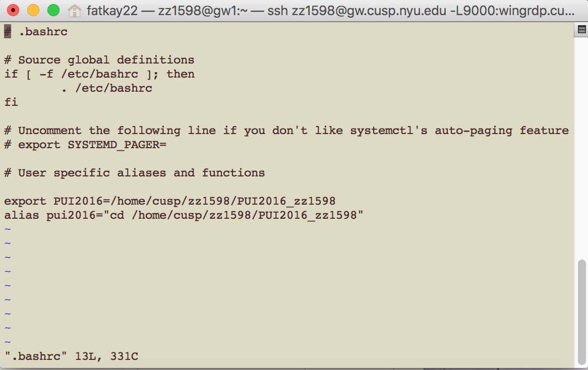
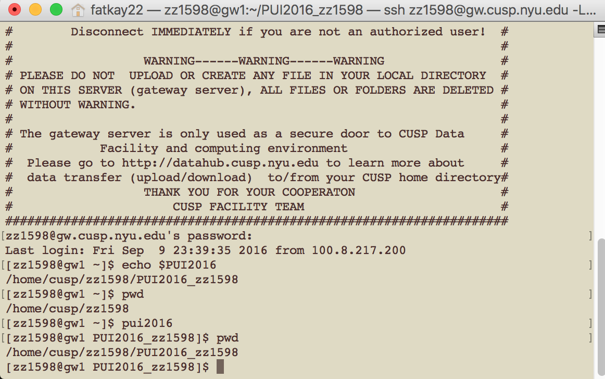

# HW1 Information

## Assignment 1
### Forked, messed and merged with Dongjie Fan(df1676), and accepted his pull request for merge as well.

## Assignment 2
### On compute, set up the following:
### 1. an environment variable PUI2016(showing the full path to the dir PUI2016)
### 2. an alias pui2016(directing to the dir PUI2016 immediately)
###
#### Details:
#### Before I started coding, Dongjie Fan mentioned that he had created an environment variable, but it was a temporary one. So I was aware of that when I started. I also watched the a YouTube video (https://www.youtube.com/watch?v=suci36U_hE) that teaches how to create, change and delete a permanent env var on OS X bash. I first did it on my own machine(Mac), and then did it on the CUSP compute, by changing the command a little bit to fit the Linux system(i.e. using vi instead of vim).
####
### Screenshot images:

#### view of .bashrc with env var PUI2016 and alias pui2016

#### commands $PUI2016 and pui2016 and outputs

