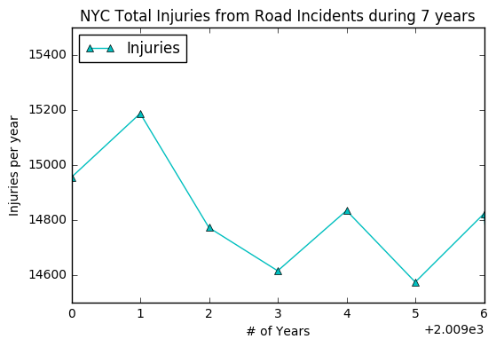

# HW7 Peer Review- ak6129

Alexey Kalinin (ak6129)  
https://github.com/ak6129/PUI2016_ak6129/blob/master/HW7_ak6129/Assignment_1.ipynb

### plot 

## Review
### Data processing part for the plot
Each step of your data processing is clear and easy to undertand. You count the number of injuries in NYC from 2009 to 2015 and plot them in your graph.

### Plot
Your plot has a good clarity with titles, names(labels) of the x and y axes, and a legend. I like the color and the trangle shape you pick for the datat points in your plot. The data points are nicely connected so I can see the changes from year to year. The size of the figure are also good. 
The only thing I would suggest is the tickers on the x-axis. I see that you put a "2.009e3" on the right side of the x-axis. I am not sure what that means. Do you mean to put a "2009-2015" instead? I think it might be clearer if you label the x-axis ticks as years(i.e.2009, 2010, 2011...,2015). You could also place a tick "14500" at the botton of the y-axis so the reader would know your y-axis starts from that number instead of "0". 

Great job! 

Peer reviewer: Ziman Zhou (zz1598)