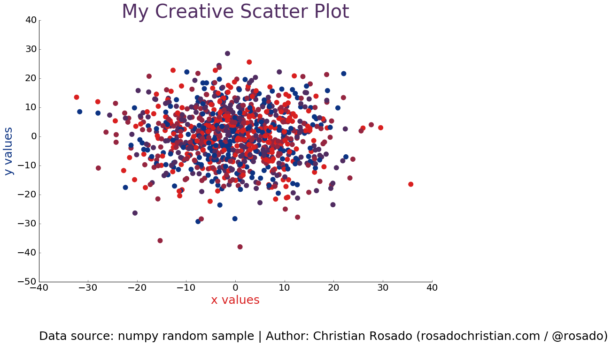

## HW7 Peer Review for cor215

Christian O Rosado (cor215),  
https://github.com/cor215/PUI2016_cor215/blob/master/HW7_cor215/Create_Your_Own_Plot_cor215.ipynb

### plot 

## Review
### Data processing part for the plot
I really like the large subtitle of each step you lead the reader to go through for the plot. I also like how you show the four colors on the four solid cylinders(color samples). You created random numbers and plot them on your graph, in a clear way. 

### Plot
Your plot looks clear with titles, x and y labels and tickers. The data points are centered nicely in your plot. The size of the figure is also good. 
The only thing I would suggest is the colors of the datapoints. Although I like these four colors, when they are gathered together and overlapped, it is not easy to identify them. You might want to make the colors more contrast, for instance, change the dark red(burgandy I suppose) color to another color in a more "yellowish" range. 

Nice work! 

Peer reviewer: Ziman Zhou (zz1598)

